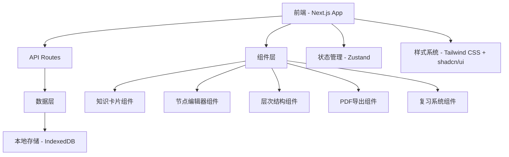

# 设计文档

## 概述

课程笔记软件采用现代Web技术栈构建，以Next.js为核心框架，结合React生态系统的优秀组件库。系统采用模块化设计，将功能分解为独立的组件和服务，确保代码的可维护性和扩展性。考虑到初学者的需求，设计遵循渐进式开发原则，从核心功能开始逐步扩展。

## 架构

### 整体架构



### 技术栈选择

**核心框架：**
- Next.js 14 (App Router) - 提供SSR/SSG和API Routes
- React 18 - 组件化UI开发
- TypeScript - 类型安全

**UI和样式：**
- Tailwind CSS - 实用优先的CSS框架
- shadcn/ui - 高质量的React组件库
- Lucide React - 图标库

**状态管理：**
- Zustand - 轻量级状态管理（比Redux简单）

**数据存储：**
- IndexedDB (通过Dexie.js) - 客户端数据持久化
- 未来可扩展到后端数据库

**特殊功能库：**
- React Flow - 可拖拽节点编辑器
- @uiw/react-md-editor - Markdown编辑器
- KaTeX - 数学公式渲染
- Prism.js - 代码语法高亮
- jsPDF + html2canvas - PDF生成

## 组件和接口

### 核心数据模型

```typescript
// 知识卡片
interface KnowledgeCard {
  id: string;
  title: string;
  content: string; // Markdown内容
  tags: string[];
  createdAt: Date;
  updatedAt: Date;
  reviewData?: ReviewData;
}

// 书籍
interface Book {
  id: string;
  title: string;
  description?: string;
  chapters: Chapter[];
  createdAt: Date;
  updatedAt: Date;
}

// 章节
interface Chapter {
  id: string;
  bookId: string;
  title: string;
  order: number;
  cards: string[]; // KnowledgeCard IDs
}

// 知识树节点
interface TreeNode {
  id: string;
  cardId: string;
  position: { x: number; y: number };
  connections: string[]; // 连接的其他节点ID
}

// 复习数据
interface ReviewData {
  difficulty: number; // 1-5
  interval: number; // 复习间隔（天）
  nextReview: Date;
  reviewCount: number;
}
```

### 主要组件架构

#### 1. 知识卡片编辑器 (CardEditor)
```typescript
interface CardEditorProps {
  card?: KnowledgeCard;
  onSave: (card: KnowledgeCard) => void;
  onCancel: () => void;
}
```

**功能：**
- Markdown实时预览
- 图片拖拽上传
- 数学公式支持
- 代码块语法高亮

#### 2. 节点编辑器 (NodeEditor)
```typescript
interface NodeEditorProps {
  nodes: TreeNode[];
  cards: KnowledgeCard[];
  onNodesChange: (nodes: TreeNode[]) => void;
  onCardEdit: (cardId: string) => void;
}
```

**功能：**
- 基于React Flow的拖拽界面
- 节点连接和关系管理
- 缩放和平移支持
- 节点搜索和过滤

#### 3. 层次结构管理器 (HierarchyManager)
```typescript
interface HierarchyManagerProps {
  books: Book[];
  onBookCreate: (book: Omit<Book, 'id'>) => void;
  onChapterCreate: (bookId: string, chapter: Omit<Chapter, 'id'>) => void;
  onStructureChange: (books: Book[]) => void;
}
```

**功能：**
- 树形结构显示
- 拖拽重新排序
- 批量操作支持

#### 4. PDF导出器 (PDFExporter)
```typescript
interface PDFExporterProps {
  content: Book | Chapter | KnowledgeCard[];
  template: ExportTemplate;
  onExport: (pdfBlob: Blob) => void;
}

interface ExportTemplate {
  id: string;
  name: string;
  layout: 'academic' | 'summary' | 'flashcard';
  styles: CSSProperties;
}
```

#### 5. 复习系统 (ReviewSystem)
```typescript
interface ReviewSystemProps {
  cards: KnowledgeCard[];
  onReviewComplete: (cardId: string, difficulty: number) => void;
  onScheduleUpdate: (schedule: ReviewSchedule[]) => void;
}
```

## 数据模型

### 数据库设计 (IndexedDB)

```typescript
// 使用Dexie.js定义数据库结构
class CourseNotesDB extends Dexie {
  books!: Table<Book>;
  chapters!: Table<Chapter>;
  cards!: Table<KnowledgeCard>;
  treeNodes!: Table<TreeNode>;
  templates!: Table<ExportTemplate>;

  constructor() {
    super('CourseNotesDB');
    this.version(1).stores({
      books: '++id, title, createdAt',
      chapters: '++id, bookId, title, order',
      cards: '++id, title, createdAt, updatedAt, *tags',
      treeNodes: '++id, cardId, position',
      templates: '++id, name, layout'
    });
  }
}
```

### 状态管理结构

```typescript
interface AppState {
  // 当前选中的内容
  selectedBook: Book | null;
  selectedChapter: Chapter | null;
  selectedCard: KnowledgeCard | null;
  
  // UI状态
  currentView: 'hierarchy' | 'editor' | 'tree' | 'review';
  isLoading: boolean;
  
  // 数据
  books: Book[];
  cards: KnowledgeCard[];
  treeNodes: TreeNode[];
  
  // 操作方法
  actions: {
    createBook: (book: Omit<Book, 'id'>) => void;
    updateCard: (card: KnowledgeCard) => void;
    deleteCard: (cardId: string) => void;
    // ... 其他操作
  };
}
```

## 错误处理

### 错误类型定义
```typescript
enum ErrorType {
  STORAGE_ERROR = 'STORAGE_ERROR',
  VALIDATION_ERROR = 'VALIDATION_ERROR',
  EXPORT_ERROR = 'EXPORT_ERROR',
  NETWORK_ERROR = 'NETWORK_ERROR'
}

interface AppError {
  type: ErrorType;
  message: string;
  details?: any;
  timestamp: Date;
}
```

### 错误处理策略
1. **数据存储错误** - 提供离线模式和数据恢复
2. **导出错误** - 降级到简化格式导出
3. **渲染错误** - 错误边界组件捕获和显示
4. **用户输入验证** - 实时验证和友好提示

## 测试策略

### 测试层次
1. **单元测试** - Jest + React Testing Library
   - 组件渲染测试
   - 工具函数测试
   - 状态管理测试

2. **集成测试**
   - 组件交互测试
   - 数据流测试
   - API路由测试

3. **端到端测试** - Playwright
   - 用户工作流测试
   - 跨浏览器兼容性测试

### 测试重点
- Markdown渲染正确性
- 拖拽操作的准确性
- 数据持久化的可靠性
- PDF导出的格式正确性
- 复习算法的准确性

## 性能优化

### 前端优化
1. **代码分割** - Next.js动态导入
2. **图片优化** - Next.js Image组件
3. **状态优化** - React.memo和useMemo
4. **虚拟滚动** - 大量卡片时的性能优化

### 数据优化
1. **懒加载** - 按需加载章节和卡片
2. **缓存策略** - 智能缓存常用数据
3. **批量操作** - 减少数据库操作次数

## 渐进式开发路径

### 阶段1：基础功能 (MVP)
- 简单的卡片CRUD操作
- 基础Markdown编辑和预览
- 简单的层次结构管理

### 阶段2：可视化编辑
- 集成React Flow节点编辑器
- 拖拽操作和连接功能
- 节点布局算法

### 阶段3：高级功能
- PDF导出和模板系统
- 复习算法实现
- 高级搜索和过滤

### 阶段4：优化和扩展
- 性能优化
- 移动端适配
- 数据同步功能